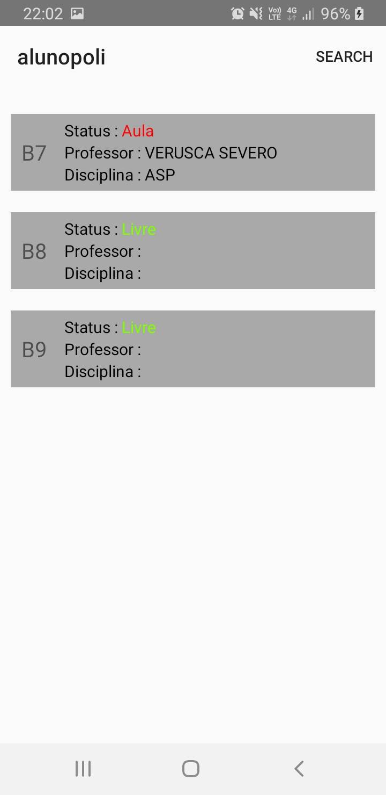

# alunopoli

The goal of this app is to make university students at the Polytechnique School of University of Pernambuco be able to easily find information about
classroom, classes and notice about possible absence of a professor.

This app (**alunopoli**) complements another app called **DATP**

**Features**
- Firebase Realtime Database
- Recycler View
- Adapters
- Linear Layout
- Constraint Layout
- Relative Layout

**How it works**

The app starts with the following screen

Then the student (**aluno**) can navigate to

