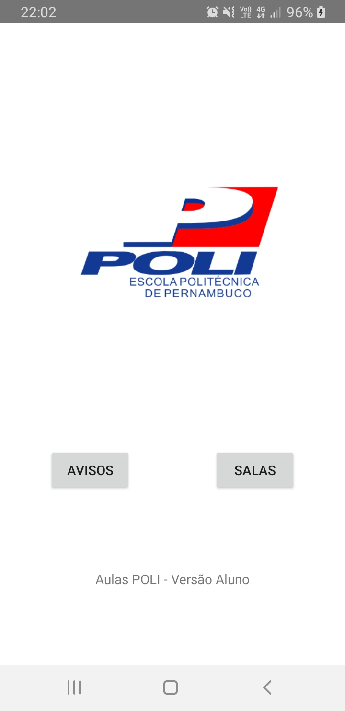

# alunopoli
First App developed in Java. Features: Firebase Realtime Database, Recycler View, Adapters, Linear Layout, Constraint Layout and Relative Layout.

[Goal](**Goal**)

The goal of this app is to make university students at University of Pernambuco be able to easily find information about
classroom, classes and notice about possible absence of a professor.

This app (alunopoli) complements another app called DATP

The app starts with the following screen

From this point the student (aluno) is able to navigate to two other activities: Salas (Rooms) and Avisos (Notices)

